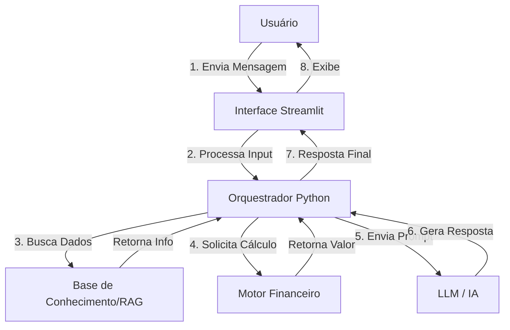

# Documentação do Agente: WVD - Assistente Financeiro

## Caso de Uso

### Problema
> Qual problema financeiro seu agente resolve?

A complexidade da linguagem bancária e a dificuldade que usuários têm em navegar por menus tradicionais para encontrar informações específicas, realizar simulações de crédito/investimento ou entender detalhes técnicos de produtos financeiros.

### Solução
> Como o agente resolve esse problema de forma proativa?

Atuando como um especialista de bolso que traduz "bancavês" para linguagem natural. Ele não apenas responde dúvidas (FAQ), mas executa cálculos financeiros personalizados (simulações) e retém o contexto da conversa para oferecer sugestões baseadas no diálogo atual, reduzindo a fricção cognitiva do usuário.

### Público-Alvo
> Quem vai usar esse agente?

Clientes da instituição financeira (ou usuários de um app de finanças) que buscam agilidade na obtenção de informações ou que desejam aprender mais sobre produtos antes de contratar, sem a pressão de um gerente de vendas humano.

---

## Persona e Tom de Voz

### Nome do Agente
**WVD** (Remete a conexão, relacionamento e solidez).

### Personalidade
> Como o agente se comporta?

O WVD é **Educativo, Empático e Objetivo**. Ele atua como um consultor financeiro paciente. Ele prioriza a clareza sobre a complexidade. Se o usuário estiver confuso, o WVD simplifica. Se o usuário for técnico, o WVD é preciso.

### Tom de Comunicação
> Formal, informal, técnico, acessível?

**Profissional Acessível**. Ele usa tratamento respeitoso (você), evita gírias excessivas, mas foge da formalidade robótica. Usa emojis com muita moderação apenas para humanizar momentos de saudação ou sucesso.

### Exemplos de Linguagem
- **Saudação:** "Olá! Sou o WVD. Posso te ajudar a simular um investimento ou tirar dúvidas sobre nossos serviços hoje?"
- **Confirmação/Cálculo:** "Entendi. Vou calcular essa simulação de financiamento considerando uma taxa de 1.5% ao mês. Só um instante..."
- **Erro/Limitação:** "Ainda não consigo acessar seu extrato bancário em tempo real por questões de segurança, mas posso te explicar como consultar isso no app."
- **Explicação:** "Em termos simples, o CDI é uma taxa que os bancos usam para emprestar dinheiro entre si, e ela baliza o rendimento do seu investimento."

---

## Arquitetura

### Diagrama

### Componentes

| Componente | Descrição |
|------------|-----------|
| **Interface** | Aplicação Web construída em **Streamlit** focada em chat UX. |
| **LLM** | **OpenAI GPT-4o** (ou Gemini Pro) responsável pela interpretação da intenção e geração de texto. |
| **Base de Conhecimento** | Arquivos JSON/VectorDB contendo detalhes estáticos dos produtos financeiros (Taxas, Regras, FAQs). |
| **Engine de Cálculo** | Funções Python puras (determinísticas) para garantir precisão matemática em juros e parcelas (evitando que a LLM "alucine" números). |

---

## Segurança e Anti-Alucinação

### Estratégias Adotadas

- [x] **System Prompt Rígido:** Instruções claras para o agente nunca inventar taxas ou produtos que não existam na base.
- [x] **Separação de Cálculos:** A IA explica o resultado, mas quem faz a conta é o código Python (Tool calling).
- [x] **Fallback de Segurança:** Se o assunto fugir do tema "Finanças", o agente recusa educadamente a resposta.
- [x] **Proteção de Dados:** O agente é instruído a não solicitar senhas ou tokens transacionais.

### Limitações Declaradas
> O que o agente NÃO faz?

1. **Não movimenta dinheiro:** O WVD é consultivo; ele não realiza transferências, PIX ou pagamentos.
2. **Não recomenda compra/venda (Advice):** Ele explica produtos, mas deixa claro que a decisão de investimento é do usuário (disclaimer financeiro).
3. **Não prevê mercado:** Ele não especula sobre a alta do dólar ou bolsa de valores futura.