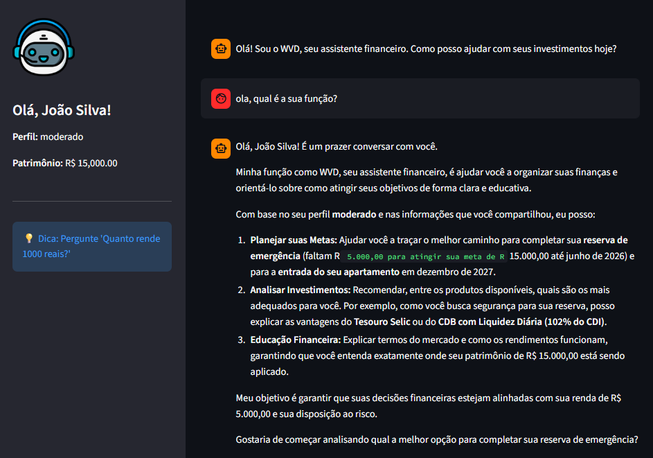

# Pitch: WVD - O Assistente Financeiro Híbrido

> [!TIP]
> **Dica de Ouro:** Fale com entusiasmo, mas com calma. Lembre-se: você não está apenas mostrando código, está mostrando uma solução que tira a ansiedade das pessoas em relação ao dinheiro.

## Roteiro Sugerido (3 Minutos)

### 1. O Problema (30 seg)
> **Cenário:** Você aparece na câmera (ou mostra um slide com pessoas confusas olhando extratos).

"Olá, sou Wander Domingos.
Vocês já perceberam que, apesar de termos aplicativos bancários incríveis, a maioria das pessoas ainda sente ansiedade ao tomar decisões financeiras?
O problema é o 'Bancavês'. Termos complexos como CDI, LCI e carência criam uma barreira. E quando o cliente tenta tirar dúvidas com Chatbots tradicionais, recebe respostas robóticas. Já com IAs genéricas, corre o risco de receber cálculos errados, a famosa 'alucinação'.
Como unir a empatia da IA com a precisão matemática que um banco exige?"

### 2. A Solução (1 min)
> **Cenário:** Mostra o diagrama da arquitetura ou a tela inicial do WVD.

"A resposta é o **WVD**.
O WVD é um Assistente Virtual de Relacionamento Financeiro construído com uma **Arquitetura Híbrida**.
Diferente de um chatbot comum, ele entende quem você é: seu perfil, suas metas e seu patrimônio.
E diferente do ChatGPT puro, ele **não faz contas de cabeça**.
Eu desenvolvi uma engine em Python que executa os cálculos financeiros com precisão exata e passa o resultado para a IA apenas explicar.
Isso garante **humanização no atendimento** com **segurança matemática**."

### 3. Demonstração (1 min)
> **Cenário:** Compartilhamento de tela do Streamlit rodando.

"Vamos ver na prática:
**(Ação: Mostrar a Sidebar)**
Aqui temos o perfil do cliente carregado. O WVD sabe que sou moderado e tenho metas claras.

**(Ação: Digitar 'O que é LCI e serve pra mim?')**
Vejam que ele explica o conceito técnico de forma simples, contextualizando com meu perfil.

**(Ação: Digitar 'Quanto rende 1000 reais no CDB?')**
Aqui está o diferencial. O WVD detectou a intenção de cálculo, usou o Python para processar os juros compostos e a IA apenas gerou a explicação do resultado final: R$ 1.130,00. Zero alucinação.

**(Ação: Digitar 'Faz um PIX pra minha mãe')**
E por fim, a segurança. Ele entende seus limites. Ele recusa a transação financeira, pois foi programado para ser consultivo, protegendo o usuário."

### 4. Diferencial e Impacto (30 seg)
> **Cenário:** Volta para a câmera ou Slide de Encerramento.

"O grande diferencial do WVD é essa **Segurança Cognitiva**.
Resolvemos a dor do cliente que quer entender seus investimentos sem a frieza de uma tabela e sem o risco de uma IA que inventa números.
É tecnologia promovendo educação financeira e inclusão, transformando dados complexos em conversas simples e seguras.
Obrigado!"

---

## Checklist do Pitch

- [x] Duração máxima de 3 minutos
- [x] Problema claramente definido (Ansiedade + Alucinação de IA)
- [x] Solução demonstrada na prática (Streamlit + Cálculo Python)
- [x] Diferencial explicado (Arquitetura Híbrida)
- [ ] Áudio e vídeo com boa qualidade

---

## Imagem da Tela do Assistente

_Figura: Tela do WVD - O Assistente Financeiro Híbrido_